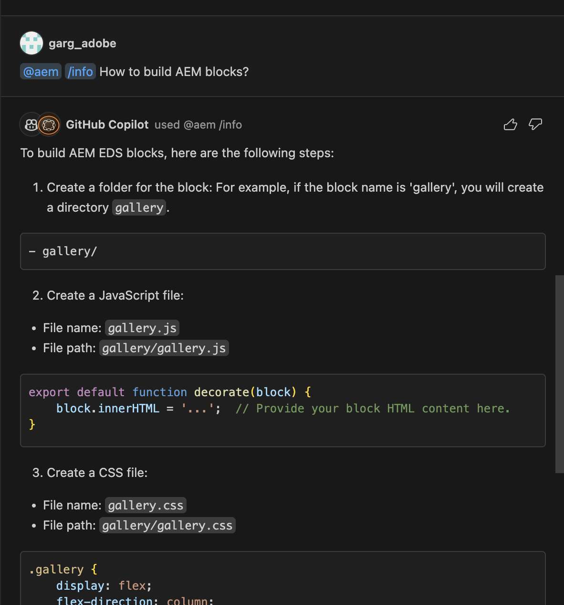

# AEM Developer Copilot Guide
AEM developer copilot is github copilot chat extension that leverages git copilot GenAI capablities with provided AEM Edge Delivery Services context provides AEM expertise at devloper fingertips in their developement environment itself. 

# Features and Commands:

- **Create**: Streamline the development of Edge Delivery ServicesS blocks with LLM using Copilot LLM. This feature eliminates the need for manual creation of folders/files, enhancing the overall developer experience.
  
- **Collection**: Access standard blocks from the AEM block collection directly, eliminating the need to copy and paste blocks from the block-collection repository and increase the adoption of standard blocks.
  
- **Info**: Retrieve any Edge Delivery Services-related information directly within your development environment through a simple prompt, avoiding the need to leave your workspace.

## References

https://code.visualstudio.com/api/extension-guides/chat

> [!IMPORTANT]  
> In order for this feature to work you need to meet the following requirements:
> - Use the [Visual Studio Code Insiders](https://code.visualstudio.com/insiders/) release
> - Use the pre-release version of the [GitHub Copilot Chat](https://marketplace.visualstudio.com/items?itemName=GitHub.copilot-chat) extension
> - Use pre-release of [AEM Copilot ](https://marketplace.visualstudio.com/items?itemName=neerajgrg93.aem-copilot)

